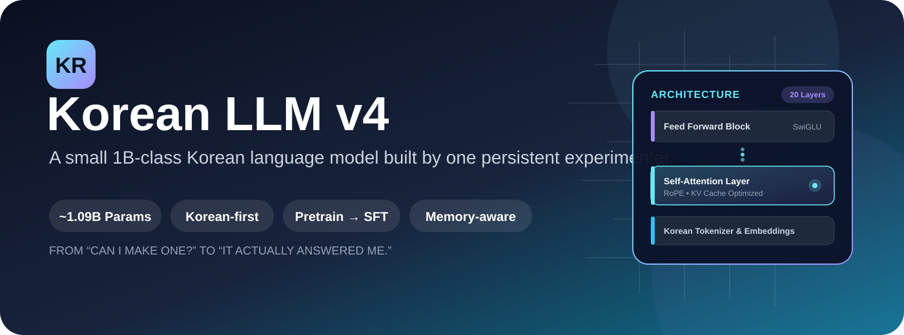

# 🇰🇷 Korean LLM v4

<p align="center">
  
</p>

<p align="center">
  
  
  
  
  
  
</p>

<p align="center">
  
  
  
  
  
  
  
</p>

> **"나도 직접 LLM 하나 만들어보고 싶다."**
>
> 이 프로젝트는 딱 그 생각 하나로 시작했습니다.

---

## 👀 한눈에 보기 | At a Glance

| 항목 | 내용 |
|---|---|
| 프로젝트 | **Korean LLM v4** |
| 목적 | 개인 환경에서 직접 만들어보는 한국어 LLM |
| 계열 | Decoder-style Transformer |
| 파라미터 | **약 1.09B** |
| Hidden Dimension | 1,920 |
| Transformer Layers | 20 |
| Attention Heads | 10 |
| FFN | SwiGLU |
| Normalization | RMSNorm |
| Position Encoding | RoPE |
| Tokenizer | `beomi/Llama-3-Open-Ko-8B` |
| 학습 흐름 | **Pretraining → SFT** |
| 기본 학습 길이 | Pretrain 100,000 / SFT 10,000 steps |
| 기본 학습 precision | BF16 |
| 옵티마이저 | AdamW8bit 지원, 미지원 시 AdamW |
| 모니터링 | Tkinter + Matplotlib |
| 체크포인트 | `.pth` |
| 로그 | `training.log` + `loss_history.json` |

| Item | Description |
|---|---|
| Project | **Korean LLM v4** |
| Purpose | Building a Korean language LLM in personal environment |
| Architecture | Decoder-style Transformer |
| Parameters | **~1.09B** |
| Hidden Dimension | 1,920 |
| Transformer Layers | 20 |
| Attention Heads | 10 |
| FFN | SwiGLU |
| Normalization | RMSNorm |
| Position Encoding | RoPE |
| Tokenizer | `beomi/Llama-3-Open-Ko-8B` |
| Training Flow | **Pretraining → SFT** |
| Default Training Steps | Pretrain 100,000 / SFT 10,000 steps |
| Training Precision | BF16 |
| Optimizer | AdamW8bit supported, fallback to AdamW |
| Monitoring | Tkinter + Matplotlib |
| Checkpoints | `.pth` |
| Logs | `training.log` + `loss_history.json` |

> **참고:** 모델 클래스의 기본 `max_seq_len`은 2048이지만, 실제 `TrainingConfig`의 기본 학습 설정은 512입니다.

> **Note:** The model class default `max_seq_len` is 2048, but the actual default training setting in `TrainingConfig` is 512.

---

## 🧩 이 프로젝트는 어떻게 시작됐나 | How This Project Started

처음부터 LLM을 만들 생각이 있었던 건 아닙니다.

그냥 평소에 AI를 쓰다 보니 어느 순간부터 조금 궁금해졌습니다.

**"얘는 대체 어떻게 만들어진 거지?"**

처음에는 AI에게 코드를 받아서 이것저것 만들어보는 정도였습니다. 그런데 계속 코드를 보다 보니까 그냥 가져다 쓰는 것보다 직접 한번 만들어보고 싶어졌습니다.

문제는 제가 아는 게 정말 별로 없었다는 겁니다.

당시에는 `7B`, `13B` 같은 숫자가 모델 크기라는 것 정도만 알고 있었습니다. Transformer가 뭔지도 잘 몰랐고, Attention이나 역전파 같은 건 이름만 들어본 수준이었습니다.

그래도 일단 작은 것부터 만들어봤습니다.

처음에는 제대로 된 모델을 만들 생각보다는 **직접 만들어보면서 배우자**는 쪽에 가까웠습니다. 그런데 막상 공부하려고 하니 또 다른 문제가 있었습니다.

제가 이해할 수 있는 수준에서 시작하면서도, 제가 궁금했던 부분까지 다뤄주는 책을 찾기가 생각보다 어려웠습니다.

그러다가 **『밑바닥부터 시작하는 딥러닝』** 시리즈를 알게 됐습니다.

그리고 제가 만들어서 공개했던 **Korean LLM v3 프로젝트를 개앞맵시 님께서 인상 깊게 봐주셨고, 딥러닝을 제대로 공부해볼 수 있도록 『밑바닥부터 시작하는 딥러닝』 시리즈 전권을 지원해주셨습니다.**

그전까지는 인터넷에서 이것저것 찾아보면서 공부하는 경우가 많았는데, 책을 보면서 직접 코드를 따라 해보고 하나씩 이해할 수 있게 됐습니다.

그래서 요즘은 모델을 무작정 크게 만드는 것보다, **제가 만들고 있는 코드가 왜 이렇게 동작하는지 이해하는 것**에도 신경 쓰고 있습니다.

지금도 책을 계속 보고 있고, 예제도 직접 따라 해보면서 공부하고 있습니다.

아직 모르는 게 훨씬 많지만, 예전처럼 그냥 코드를 받아서 실행하는 것보다는 조금씩이라도 직접 이해하면서 만들어가는 게 목표입니다.

---

I didn't initially plan to build an LLM. I just got curious over time while using AI.

**"How on earth is this thing made?"**

At first, I got code snippets from AI and just played around with them. But as I kept reading the code, I felt the urge to build something myself instead of just using existing code.

The problem was that I knew almost nothing.

Back then, I only knew that numbers like `7B` and `13B` represented model sizes. I didn't understand Transformers well, and concepts like Attention or backpropagation were just names to me.

Still, I started small anyway.

Initially, my approach was closer to **learning by building** rather than trying to create a perfect model. But when I actually tried to learn, I ran into another problem.

It was surprisingly hard to find books that started at my understanding level but also covered the topics I was curious about.

Then I discovered the **"Deep Learning from Scratch"** book series.

My Korean LLM v3 project caught the attention of **Gaepang Maepsi (개앞맵시), who generously supported my deep learning study by providing the entire "Deep Learning from Scratch" series.**

Before that, I mostly learned by searching the internet randomly. But with the books, I could follow code examples directly and understand concepts step by step.

Now, instead of just building bigger models, I focus on **understanding why my code works the way it does.**

I'm still reading the books and working through examples. I still have much to learn, but my goal is to gradually build with understanding rather than just running code I don't fully comprehend.

```text
작은 신경망 (Small Neural Networks)
    ↓
딥러닝 기본 원리 (Deep Learning Fundamentals)
    ↓
Transformer 이해 (Understanding Transformers)
    ↓
작은 언어 모델 (Small Language Model)
    ↓
541M급 모델 (541M-class Model)
    ↓
1B급 모델 (1B-class Model)
    ↓
Korean LLM v4
```

그래서 이 프로젝트는 단순히 **"LLM 하나를 만들어보자"**에서 끝나는 프로젝트가 아닙니다.

처음에는 아무것도 몰랐던 상태에서 시작해서,

**직접 구현하고 → 이해하고 → 실패하고 → 고치고 → 다시 학습하는 과정**

그 자체를 기록하는 프로젝트이기도 합니다.

---

So this project isn't just about **"building one LLM."**

It starts from knowing almost nothing and documents the entire process of:

**implementing → understanding → failing → fixing → learning again**

---

## 🧱 처음에는 코드부터 만들기 시작했습니다 | I Started with Code (No Grand Design)

처음에는 멋진 아키텍처 설계 문서가 있었던 것도 아닙니다.

AI에게 코드 조각을 받아서 붙이고,

실행하고,

에러를 보고,

다시 고치고,

또 실행했습니다.

특히 초반에는 **Dimension Error가 안 나는 것만으로도 기뻤습니다.**

데이터를 모으고 정리하는 과정도 직접 해봤고, 학습이 잘 되는지 확인하기 위해 컴퓨터 화면을 계속 바라봤습니다.

처음부터 모든 것을 혼자 알고 만든 프로젝트는 아닙니다.

AI의 도움도 받았습니다.

다만 그 과정에서 코드가 실제로 돌아가는지 확인하고, 에러를 고치고, 구조를 바꾸고, 학습 결과를 보고 다음 시도를 결정하는 일은 계속 직접 해야 했습니다.

그래서 이 저장소는 "처음부터 모든 걸 알고 만든 코드"라기보다는 **모르는 상태에서 시작해서 하나씩 이해해간 실험 기록**에 가깝습니다.

---

There was no fancy architecture design document to begin with.

I got code snippets from AI, pasted them together, ran them, saw errors, fixed them, and ran again.

Especially early on, I was just happy when **dimension errors didn't show up.**

I collected and organized data myself, and watched the screen continuously to check if training was working properly.

This isn't a project where I knew everything from the start and built alone.

I got help from AI.

But throughout the process, I had to verify that the code actually ran, fix errors, change structures, check training results, and decide next steps myself.

So this repository is closer to **an experimental log of understanding step-by-step from a state of not knowing**, rather than "code written with complete knowledge from day one."

---

## 🕰️ v1 이전 → v1 → v2 → v3 → v4 | From Pre-v1 to v4

### 🟦 초기 실험 · 약 50M | Early Experiments · ~50M

첫 모델은 위키피디아 데이터로 학습한 아주 작은 모델이었습니다.

크기는 약 **50M(5천만) 파라미터**.

대화가 가능한 수준은 아니었지만, 어느 정도 문법에 맞는 문장을 만들어내기 시작했습니다.

지금은 이 모델이 남아 있지 않습니다.

그래도 이때 처음으로

> "어? 진짜 문장을 만들긴 하네?"

라는 느낌을 받았습니다.

그 작은 성공 때문에 여기서 멈추기가 어려워졌습니다.

---

The first model was a very small one trained on Wikipedia data.

Size was about **50M (50 million) parameters**.

It wasn't capable of conversation, but it started generating grammatically correct sentences.

That model doesn't exist anymore now.

But at that moment, I first felt:

> "Wait, it actually generates sentences?"

That small success made it hard to stop here.

---

### 🟪 v1 · 약 541M | v1 · ~541M

그 다음 목표는 명확했습니다.

**"이번에는 채팅이 되게 만들어보자."**

그래서 모델을 계속 키우고 데이터 형식도 대화 중심으로 바꾸면서 v1을 발전시켰습니다.

결과적으로 약 **541M 파라미터**까지 올라갔습니다.

여전히 부족한 부분은 많았지만, 그냥 문장을 생성하는 모델에서 **질문과 응답을 시도하는 모델**로 방향이 바뀌었습니다.

---

The next goal was clear.

**"This time, let's make it actually chat."**

So I kept scaling up the model and changed the data format to focus on conversations, developing v1 further.

Eventually, it reached about **541M parameters**.

There were still many shortcomings, but the direction shifted from just generating sentences to **attempting questions and answers.**

---

### 🟩 v2 · 약 1.09B | v2 · ~1.09B

그다음에는 아예 1B급으로 올렸습니다.

약 **1.09B(10억 9천만) 파라미터** 규모까지 모델을 키웠습니다.

방학 동안 시간이 날 때마다 컴퓨터를 켜고 학습을 돌렸습니다.

긴 학습 끝에 어느 순간 **44,000 step**에 도달했습니다.

그리고 테스트를 위해 채팅창에:

```text
안녕?
```

이라고 입력했습니다.

모델이:

```text
안녕하세요! 오늘은 무엇을 도와드릴까요?
```

라고 답했습니다.

그 순간은 정말 컸습니다.

"내가 만든 모델이 진짜 대답했다"는 느낌이었습니다.

---

Next, I scaled it up to 1B-class.

The model grew to **1.09B (1.09 billion) parameters.**

During vacation, whenever I had time, I turned on the computer and ran training.

After a long training period, it eventually reached **44,000 steps.**

For testing, I typed in the chat:

```text
안녕? (Hi?)
```

The model responded:

```text
안녕하세요! 오늘은 무엇을 도와드릴까요?
(Hello! What can I help you with today?)
```

That moment was huge.

It felt like "my model actually answered."

---

### 🟥 그런데 바로 다음 질문에서 문제가 생겼습니다 | But Problems Emerged in the Next Question

다른 질문을 던져보니 전혀 엉뚱한 대답이 나오기 시작했습니다.

모델이 사용자의 지시를 제대로 따르지 않는 문제가 있었습니다.

그동안 학습한 결과를 보고 있자니 굉장히 아까웠지만, 원인을 고치려면 결과물을 과감하게 버리고 다시 시작하는 편이 낫다고 판단했습니다.

이 과정에서 배운 건 꽤 단순했습니다.

> **파라미터가 커진다고 원하는 모델이 자동으로 만들어지는 것은 아닙니다.**

데이터 형식, 학습 목적, 생성 방식, loss 처리 같은 것들이 전부 같이 맞아야 했습니다.

---

When I asked different questions, it started giving completely wrong answers.

The model wasn't following user instructions properly.

Even though all that training felt like a waste, I decided it was better to discard the results and start over to fix the root cause.

What I learned from this process was quite simple:

> **Just having more parameters doesn't automatically create the model you want.**

Data format, training objective, generation method, and loss handling all had to align together.

---

### 🟧 v3 · 모델을 덜 무겁게 | v3 · Making the Model Lighter

1B급 모델은 생각보다 무거웠습니다.

VRAM 사용량이 커지면서 일반적인 환경에서 돌리기가 부담스러웠습니다.

그래서 v3에서는 **양자화와 경량화**에 관심을 두었습니다.

목표는 간단했습니다.

> "성능을 가능한 한 유지하면서 더 쉽게 돌릴 수 있게 만들자."

학습 자체를 계속 확장하기보다는, 이미 만든 모델을 실제로 사용할 때 생기는 문제에 집중했습니다.

---

1B-class models were heavier than expected.

As VRAM usage grew, running it in typical environments became burdensome.

So in v3, I focused on **quantization and optimization.**

The goal was simple:

> "Keep performance as intact as possible while making it easier to run."

Rather than continuing to scale training itself, I focused on practical problems when using the model I'd already built.

---

### 🩷 v4 · 데이터와 학습 파이프라인을 다시 설계 | v4 · Redesigning Data and Training Pipeline

v4에서는 생각을 조금 바꿨습니다.

**작은 데이터셋으로 1B 모델을 억지로 학습시키는 것보다, 먼저 충분한 텍스트를 학습시키고 그 다음에 대화 방법을 가르치는 게 낫지 않을까?**

그래서 학습 과정을:

```text
┌───────────────────┐
│ Korean Text Corpus│
└─────────┬─────────┘
          ↓
┌───────────────────┐
│   Pretraining     │
│ "언어 자체를 학습" │
└─────────┬─────────┘
          ↓
┌───────────────────┐
│       SFT         │
│ "질문에 답하는 법" │
└─────────┬─────────┘
          ↓
┌───────────────────┐
│   Korean LLM v4   │
└───────────────────┘
```

형태로 구성했습니다.

---

In v4, I changed my thinking.

**Instead of forcing a 1B model to train on small datasets, why not first train on sufficient text and then teach it how to chat?**

So I structured the training process as:

```text
┌───────────────────┐
│ Korean Text Corpus│
└─────────┬─────────┘
          ↓
┌───────────────────┐
│   Pretraining     │
│  "Learn language" │
└─────────┬─────────┘
          ↓
┌───────────────────┐
│       SFT         │
│  "Learn to chat"  │
└─────────┬─────────┘
          ↓
┌───────────────────┐
│   Korean LLM v4   │
└───────────────────┘
```

---

## 🧠 v4 모델 구조 | v4 Model Architecture

모델의 핵심 Transformer 구성은 코드 안에서 직접 구현되어 있습니다.

```python
class RMSNorm(nn.Module):
    ...

class SwiGLU(nn.Module):
    ...

class Attention(nn.Module):
    ...

class TransformerBlock(nn.Module):
    ...

class KoreanLLM(nn.Module):
    ...
```

즉, 단순히 외부 LLM 클래스를 가져와 이름만 바꾼 구조가 아닙니다.

Embedding부터 Attention, FFN, normalization, output layer까지 모델의 핵심 부분을 직접 연결해 하나의 모델로 구성했습니다.

---

The core Transformer components are implemented directly in the code:

```python
class RMSNorm(nn.Module):
    ...

class SwiGLU(nn.Module):
    ...

class Attention(nn.Module):
    ...

class TransformerBlock(nn.Module):
    ...

class KoreanLLM(nn.Module):
    ...
```

It's not just importing an external LLM class and renaming it.

I directly wired together the core components—from Embedding to Attention, FFN, normalization, and output layer—into one model.

---

## 📐 핵심 하이퍼파라미터 | Core Hyperparameters

| 항목 | 값 |
|---|---:|
| `dim` | **1920** |
| `n_layers` | **20** |
| `n_heads` | **10** |
| Head Dimension | **192** |
| FFN Hidden | **4800** (`1920 × 2.5`) |
| Vocab Size | tokenizer 크기에 따라 결정 |
| Max Sequence Length | 학습 기본값 **512** |
| Output Layer | Embedding weight tying |
| Position | Rotary Position Embedding |
| Norm | RMSNorm |
| Activation | SwiGLU |

| Item | Value |
|---|---:|
| `dim` | **1920** |
| `n_layers` | **20** |
| `n_heads` | **10** |
| Head Dimension | **192** |
| FFN Hidden | **4800** (`1920 × 2.5`) |
| Vocab Size | Determined by tokenizer size |
| Max Sequence Length | Training default **512** |
| Output Layer | Embedding weight tying |
| Position | Rotary Position Embedding |
| Norm | RMSNorm |
| Activation | SwiGLU |

---

## 🔍 내부에서 실제로 하는 일 | What Happens Inside

### 1. Embedding

토큰 ID를 1920차원 벡터로 변환합니다.

```text
token id
   ↓
Embedding
   ↓
1920-dimensional representation
```

---

Converts token IDs to 1920-dimensional vectors:

```text
token id
   ↓
Embedding
   ↓
1920-dimensional representation
```

---

### 2. Attention

각 Transformer block에서 Q, K, V를 만들고 Attention을 계산합니다.

코드에서는:

```python
self.wq = nn.Linear(dim, dim, bias=False)
self.wk = nn.Linear(dim, dim, bias=False)
self.wv = nn.Linear(dim, dim, bias=False)
self.wo = nn.Linear(dim, dim, bias=False)
```

형태로 구성합니다.

그리고 PyTorch의 scaled dot-product attention을 사용합니다.

```python
F.scaled_dot_product_attention(...)
```

---

In each Transformer block, Q, K, V are created and Attention is computed:

```python
self.wq = nn.Linear(dim, dim, bias=False)
self.wk = nn.Linear(dim, dim, bias=False)
self.wv = nn.Linear(dim, dim, bias=False)
self.wo = nn.Linear(dim, dim, bias=False)
```

Using PyTorch's scaled dot-product attention:

```python
F.scaled_dot_product_attention(...)
```

---

### 3. RoPE

Q와 K에는 Rotary Position Embedding을 적용합니다.

```text
Q ──┐
    ├── RoPE ── Attention
K ──┘
```

이렇게 토큰의 위치 정보를 Attention 계산에 반영합니다.

---

Rotary Position Embedding is applied to Q and K:

```text
Q ──┐
    ├── RoPE ── Attention
K ──┘
```

This incorporates token position information into Attention calculation.

---

### 4. SwiGLU

Attention 뒤에는 SwiGLU 기반 Feed Forward Network가 들어갑니다.

```python
return self.w2(
    F.silu(self.w1(x)) * self.w3(x)
)
```

즉, 단순한 `Linear → Activation → Linear`보다 조금 더 구조화된 FFN을 사용합니다.

---

After Attention, a SwiGLU-based Feed Forward Network follows:

```python
return self.w2(
    F.silu(self.w1(x)) * self.w3(x)
)
```

So it uses a more structured FFN than simple `Linear → Activation → Linear`.

---

### 5. Residual Connection

각 block에서는 Attention과 FFN 뒤에 residual connection을 사용합니다.

```python
x = x + h
x = x + self.feed_forward(...)
```

Transformer block을 쌓을 때 중요한 기본 골격입니다.

---

Residual connections are used after Attention and FFN in each block:

```python
x = x + h
x = x + self.feed_forward(...)
```

This is a crucial fundamental component when stacking Transformer blocks.

---

### 6. Weight Tying

Embedding과 output projection의 weight를 공유합니다.

```python
self.output.weight = self.embed.weight
```

따라서 같은 파라미터를 두 군데에서 따로 저장하는 대신 하나를 공유합니다.

---

Embedding and output projection weights are shared:

```python
self.output.weight = self.embed.weight
```

So instead of storing the same parameters in two places separately, they share one.

---

## 📚 데이터 파이프라인 | Data Pipeline

데이터 처리도 이번 버전에서 꽤 많은 부분을 손봤습니다.

단순히 다운로드하고 바로 학습시키지 않고, 캐시와 manifest를 사용합니다.

```text
Hugging Face
      ↓
DatasetManager
      ↓
LocalDataset
      ↓
DataLoader
      ↓
Training
```

---

Data processing received substantial improvements in this version.

Rather than simply downloading and training, caching and manifests are used:

```text
Hugging Face
      ↓
DatasetManager
      ↓
LocalDataset
      ↓
DataLoader
      ↓
Training
```

---

## 🚀 실행 | Execution

### 🖥️ 시스템 요구사양 (Windows) | System Requirements (Windows)

본 모델 학습 및 추론은 64GB 이상의 RAM, 고성능 CPU, 1TB 이상의 NVMe SSD, **최소 12GB 이상의 VRAM**이 필수입니다.

| 구분 | 최소 사양 | 권장 사양 |
|---|---|---|
| OS | Windows 10 (64-bit) | Windows 11 (64-bit) |
| CPU | 고성능 8코어 (i7-13700K / Ryzen 7700X) | 최상위 다중코어 (i9-14900K / Ryzen 7950X) |
| RAM | 64 GB | 64 GB ~ 128 GB 이상 |
| GPU (VRAM) | **NVIDIA 12GB 이상 [필수]** (RTX 3060 12GB / RTX 4070) | NVIDIA 24GB (RTX 3090 / RTX 4090) |
| 저장공간 | 1 TB 이상의 NVMe SSD | 2 TB 이상의 고속 NVMe SSD |

---

Training and inference require 64GB+ RAM, high-performance CPU, 1TB+ NVMe SSD, and **minimum 12GB+ VRAM**:

| Item | Minimum | Recommended |
|---|---|---|
| OS | Windows 10 (64-bit) | Windows 11 (64-bit) |
| CPU | High-end 8-core (i7-13700K / Ryzen 7700X) | Top multi-core (i9-14900K / Ryzen 7950X) |
| RAM | 64 GB | 64 GB ~ 128 GB+ |
| GPU (VRAM) | **NVIDIA 12GB+ [Required]** (RTX 3060 12GB / RTX 4070) | NVIDIA 24GB (RTX 3090 / RTX 4090) |
| Storage | 1TB+ NVMe SSD | 2TB+ high-speed NVMe SSD |

---

### 가장 간단하게 | The Simplest Way

```bash
python korean_llm_advanced_v4.py
```

이렇게 실행하면 기본적으로:

```text
auto
 ↓
pretraining
 ↓
checkpoint
 ↓
SFT
```

순서로 들어갑니다.

---

Running this way executes:

```text
auto
 ↓
pretraining
 ↓
checkpoint
 ↓
SFT
```

in order.

---

### Pretraining만 | Pretraining Only

```bash
python korean_llm_advanced_v4.py \
    --stage pretrain \
    --pretrain-steps 100000
```

---

### SFT만 | SFT Only

```bash
python korean_llm_advanced_v4.py \
    --stage sft \
    --sft-steps 10000
```

---

### GUI 끄기 | Disable GUI

```bash
python korean_llm_advanced_v4.py --no-gui
```

---

### 체크포인트에서 이어하기 | Resume from Checkpoint

```bash
python korean_llm_advanced_v4.py \
    --resume-from-checkpoint latest
```

---

### 별도 데이터셋 지정 | Specify Custom Dataset

```bash
python korean_llm_advanced_v4.py \
    --stage pretrain \
    --dataset repository_id:configuration
```

여러 개를 지정하는 방식도 지원합니다.

Multiple datasets can also be specified:

```bash
python korean_llm_advanced_v4.py \
    --dataset dataset_a \
    --dataset dataset_b
```

---

## 📊 버전별 비교 | Version Comparison

| 버전 | 대략적인 크기 | 중심 목표 | 결과 |
|---|---:|---|---|
| 초기 | ~50M | 문장 생성 자체 실험 | 문법 비슷한 문장 생성 |
| v1 | ~541M | 채팅형 모델 | 질문/응답 방향으로 발전 |
| v2 | ~1.09B | 모델 체급 확대 | 응답은 가능했지만 지시 따르기 문제 발견 |
| v3 | 1B급 | 경량화 / 양자화 | 실제 사용성 개선에 집중 |
| **v4** | **~1.09B** | 데이터 + 학습 파이프라인 | **Pretraining → SFT** |

| Version | Size | Main Goal | Result |
|---|---:|---|---|
| Early | ~50M | Experiment with sentence generation | Grammar-like sentence generation |
| v1 | ~541M | Chat-capable model | Advanced toward Q&A |
| v2 | ~1.09B | Expand model scale | Response possible but instruction-following issues found |
| v3 | 1B-class | Optimization / Quantization | Focus on practical usability |
| **v4** | **~1.09B** | Data + Training Pipeline | **Pretraining → SFT** |

---

## 🧭 v4에서 가장 크게 달라진 생각 | Biggest Mindset Change in v4

예전에는:

```text
모델 크기를 키우면
    ↓
성능이 좋아질 것
```

이라고 생각하기 쉬웠습니다.

지금은 조금 다르게 봅니다.

```text
모델
 +
데이터
 +
학습 방식
 +
loss 설계
 +
생성 방식
 +
메모리 관리
 =
결과
```

결국 1B라는 숫자 하나만 봐서는 모델이 어떤 상태인지 알 수 없습니다.

그래서 v4에서는 모델 크기를 더 올리는 것보다 **학습 파이프라인을 정돈하는 것**에 먼저 집중했습니다.

---

Previously, I'd easily think:

```text
Increase model size
    ↓
Performance improves
```

Now I see it differently:

```text
Model
 +
Data
 +
Training Method
 +
Loss Design
 +
Generation Method
 +
Memory Management
 =
Results
```

You can't tell a model's actual state just from the "1B" number.

So in v4, I focused first on **refining the training pipeline** rather than scaling the model size further.

---

## 🔬 이 프로젝트에서 직접 다뤄본 것 | What I've Directly Tackled in This Project

이 저장소 하나 안에서 상당히 많은 문제를 직접 부딪혀봤습니다.

### 🤖 모델 | Model

- Embedding
- Attention
- Q / K / V
- RoPE
- RMSNorm
- SwiGLU
- Residual connection
- Weight tying
- KV cache

### 📦 데이터 | Data

- Hugging Face dataset
- local cache
- manifest
- parquet
- streaming
- train/validation split
- 여러 데이터 형식 통합 (Multiple data format integration)
- prompt/response masking

### ⚙️ 학습 | Training

- BF16
- AdamW
- AdamW8bit
- gradient accumulation
- gradient clipping
- cosine scheduler
- warmup
- checkpoint resume

### 🖥️ 개발 도구 | Development Tools

- logging
- JSON loss history
- Tkinter
- Matplotlib
- CLI arguments
- checkpoint manager
- CPU inference

---

## 🧪 지금도 실험 중 | Still Experimenting

이 프로젝트는 아직 **완성된 상용 LLM**이라고 부를 수 있는 단계는 아닙니다.

데이터셋을 바꾸면 결과가 달라지고, 학습량을 바꾸면 결과가 달라지고, 같은 모델이어도 sampling 설정에 따라 출력이 달라집니다.

그래서 지금도 로그를 저장하면서 단계별로 비교하는 방식으로 실험하고 있습니다.

특히 앞으로는:

- 더 많은 데이터
- 데이터 품질 개선
- 학습량 조절
- SFT 데이터 구성 개선
- 생성 품질 비교
- 경량화
- 다양한 checkpoint 비교

를 계속 확인해볼 생각입니다.

---

This project isn't yet at the stage of being called a **completed commercial LLM**.

Changing datasets changes results, changing training amount changes results, and even with the same model, output varies with sampling settings.

So I'm still experimenting by saving logs and comparing step-by-step.

Going forward, I plan to keep checking:

- More data
- Data quality improvement
- Training amount adjustment
- SFT data composition improvement
- Generation quality comparison
- Optimization
- Various checkpoint comparison

---

## ⚠️ 현실적인 주의사항 | Realistic Considerations

### 1. 1B라고 해서 모든 질문에 잘 대답하는 것은 아닙니다. | Just Because It's 1B Doesn't Mean It Answers All Questions Well.

모델의 파라미터 수만으로 실제 대화 품질을 판단할 수 없습니다.

You can't judge actual conversation quality just by parameter count.

### 2. 학습 데이터가 중요합니다. | Training Data Matters.

데이터의 품질, 중복, 형식, 길이 등에 따라 결과가 달라집니다.

Results differ based on data quality, duplication, format, and length.

### 3. VRAM 요구량은 환경에 따라 달라집니다. | VRAM Requirements Vary by Environment.

BF16, optimizer 상태, batch size, sequence length, CUDA 버전 등에 따라 실제 사용량이 달라질 수 있습니다.

Actual usage may vary depending on BF16, optimizer state, batch size, sequence length, CUDA version, etc.

### 4. 데이터셋 라이선스를 확인해야 합니다. | Check Dataset Licenses.

이 저장소의 코드에는 여러 Hugging Face 데이터셋을 불러올 수 있는 기능이 있으며, 사용할 때는 해당 데이터셋의 라이선스와 이용 조건을 직접 확인해야 합니다.

This code can load multiple Hugging Face datasets. When using them, you must verify their licenses and usage terms directly.

---

## 🧑‍💻 AI의 도움에 대해서 | About AI Assistance

이 프로젝트는 AI의 도움을 받았습니다.

처음부터 모든 코드를 혼자 작성했다고 말하지 않겠습니다.

특히 프로젝트 초반에는 모델 구조나 PyTorch 사용법을 이해하는 데 AI의 설명과 코드 예제가 큰 도움이 됐습니다.

그렇다고 해서 그냥 코드를 받아서 끝낸 프로젝트도 아닙니다.

실제로 학습을 돌리고,

```text
에러
 ↓
수정
 ↓
재학습
 ↓
로그 확인
 ↓
결과 확인
 ↓
다음 수정
```

을 반복했습니다.

모델이 이상하게 출력하면 원인을 찾아야 했고, 데이터가 잘못 들어가면 다시 확인해야 했고, VRAM이 부족하면 구조를 바꿔야 했습니다.

그래서 이 프로젝트에서 가장 중요한 부분은 "AI가 코드를 얼마나 많이 작성했느냐"보다 **AI의 도움을 받아도 직접 실행하고 실패하고 고치면서 결국 무엇이 동작하는지 알아가는 과정**이라고 생각합니다.

---

This project received AI assistance.

I won't claim I wrote all the code alone from the start.

Especially early on, AI explanations and code examples greatly helped me understand model structure and PyTorch usage.

But it's not just a project where I took code and stopped.

I actually ran training and repeated:

```text
Error
 ↓
Fix
 ↓
Retrain
 ↓
Check logs
 ↓
Check results
 ↓
Next fix
```

When the model output weirdly, I had to find the cause. When data was wrong, I had to recheck. When VRAM was insufficient, I had to restructure.

So the most important part of this project is not "how much code did AI write" but rather **the process of, with AI assistance, directly running, failing, fixing, and eventually understanding what actually works**.

---

## 🏁 마지막으로 | Finally

이 프로젝트는 처음부터 거대한 목표를 가지고 만든 것은 아닙니다.

처음에는 무료 사용량이 아쉬웠고,

그다음에는 로컬 모델이 너무 무거웠고,

그래서

> **"그러면 내가 직접 만들어보면 되지 않을까?"**

라는 생각이 들었습니다.

그때는 LLM이 어떻게 만들어지는지도 거의 몰랐습니다.

50M 모델에서 시작해서,

541M으로 키워보고,

1.09B까지 올려보고,

버그 때문에 결과를 버려보기도 하고,

양자화를 시도하고,

결국 v4에서는 데이터와 학습 과정을 다시 설계하게 됐습니다.

아직 갈 길이 꽤 남았습니다.

그래도 적어도 하나는 알게 됐습니다.

> **직접 만들어본 모델은 숫자로만 보는 모델보다 훨씬 재미있습니다.**

이 저장소가 누군가에게도

> "나도 한번 만들어볼까?"

라는 생각을 만들어준다면 충분합니다.

---

This project wasn't made with grand goals from the start.

Initially, I was frustrated with free usage limits.

Then local models were too heavy.

So I thought:

> **"Could I just build one myself?"**

At that time, I barely knew how LLMs were made.

Starting from a 50M model,

scaling to 541M,

pushing to 1.09B,

discarding results due to bugs,

attempting quantization,

and eventually redesigning data and training in v4.

There's still quite a path ahead.

But at least I've learned one thing:

> **A model you built yourself is way more interesting than just looking at numbers.**

If this repository makes someone think:

> "Maybe I should try building one too?"

That would be enough.

---

<p align="center">

### ⭐ 마음에 들었다면 Star 하나만 부탁드립니다! | If you liked it, please consider giving a star!

**Korean LLM v4**  
*From small experiments to a 1B-class Korean LLM.*

</p>

---

**Last Updated:** 2026.09.16  
**Language:** Korean / English (이중언어 | Bilingual)